# **Manual de construcción y configuración**

## **Contenido**   
- [Tablas de configuraciones](#idTBConf)
- [Topología 1](#idTopo1)
- [Topología 2](#idTopo2)
- [Configuración VPN ](#idVPN)

## **Tablas de configuraciones**<a name="idTBConf"></a>
| VIRTUAL 	|         HOST        	| CONECTADO A 	|   DIRECCION IP  	| VLAN 	|
|:-------:	|:-------------------:	|:-----------:	|:---------------:	|:----:	|
|    Si   	| Informática 1       	|     SW1     	|  192.168.126.15 	|  36  	|
|    No   	| Informática 2       	|     SW3     	|  192.168.126.30 	|  36  	|
|    Si   	| Server Informatica  	|     SW6     	| 192.168.126.150 	|  36  	|
|    Si   	| Ventas 1            	|     SW3     	|  192.168.226.15 	|  46  	|
|    No   	| Ventas 2            	|     SW4     	|  192.168.226.30 	|  46  	|
|    Si   	| Server Ventas       	|     SW7     	| 192.168.226.150 	|  46  	|
|    No   	| Contabilidad 1      	|     SW1     	|   192.168.26.15 	|  56  	|
|    Si   	| Contabilidad 2      	|     SW4     	|   192.168.26.30 	|  56  	|
|    Si   	| Server Contabilidad 	|     SW6     	|  192.168.26.150 	|  56  	|

## **Topología 1**<a name="idTopo1"></a>
Esta topología está compuesta por:
- 3 VPCS
- 3 computadoras virtualizadas en VMware
- 4 Switch
- 1 Cloud

### **Configuración de Switchs**
Para realizar la configuración necesaria de las vlans y los enlaces troncales en los switch, se debe dar doble clic encima del switch a configurar. En el área de puertos dar doble clic para seleccionar el que se desea configurar este aparecerá en el área de settings. Si se requiere configurar la vlan solo se debe cambiar el campo VLAN con el número de la vlan correspondiente. Si solo se requiere configurar como modo troncal se debe cambiar el campo type a modo dot1q

<div align="center">
    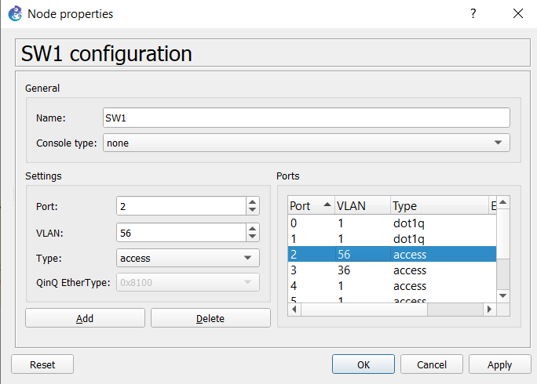
    <p align="center">Configuracion SW1</p>
</div>
<br/>

<div align="center">
    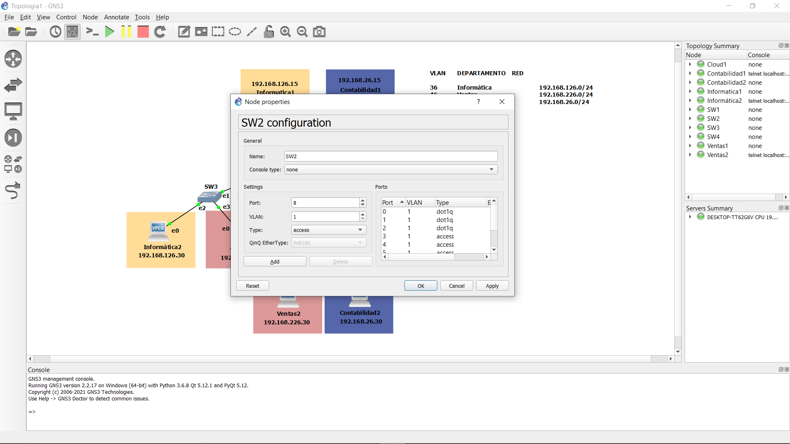
    <p align="center">Configuracion SW2</p>
</div>
<br/>

<div align="center">
    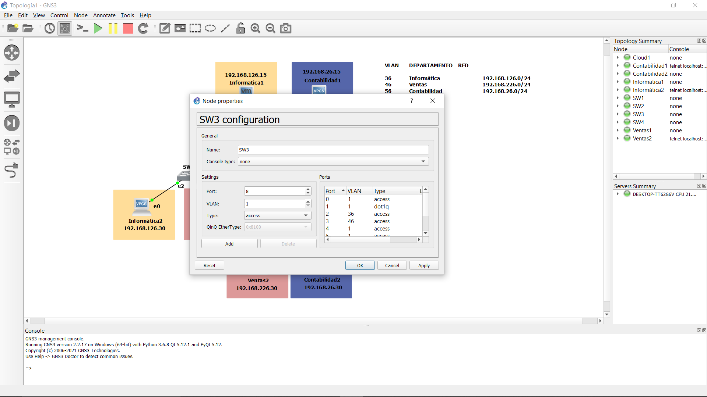
    <p align="center">Configuracion SW3</p>
</div>
<br/>

<div align="center">
    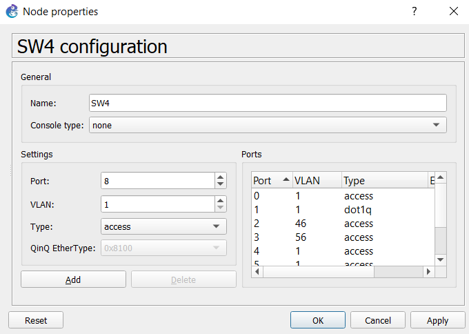
    <p align="center">Configuracion SW4</p>
</div>

### **Configuración de VPCS**
Para realizar la configuración de las VPCS solo es necesario asignarles la dirección IP, mascara de subred y gateway correspondiente con el siguiente comando

```bash
ip <IP Address> <Subnet Mask> <Default Gateway>
```

<div align="center">
    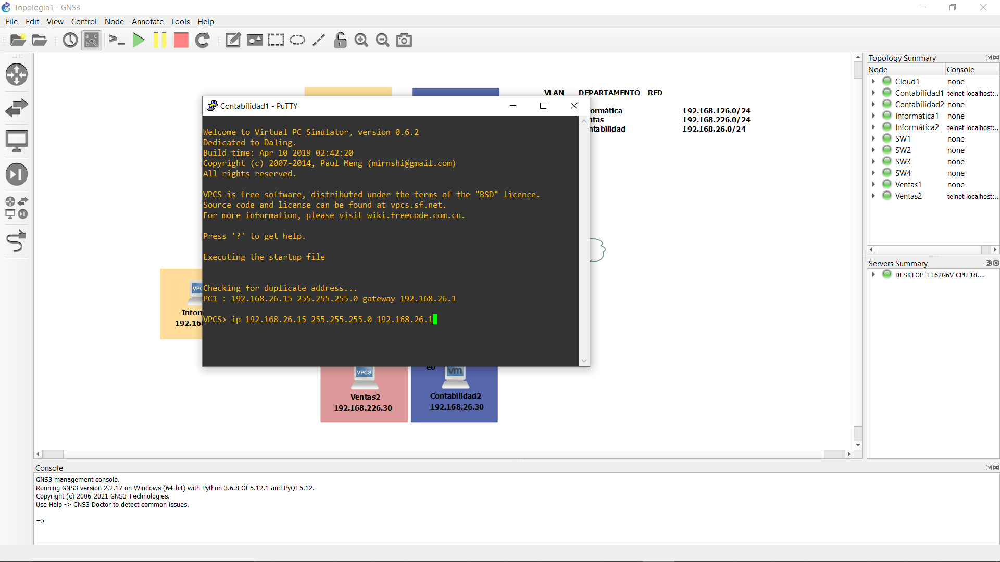
    <p align="center">Configuracion VPCS Contabilidad</p>
</div>
<br/>

<div align="center">
    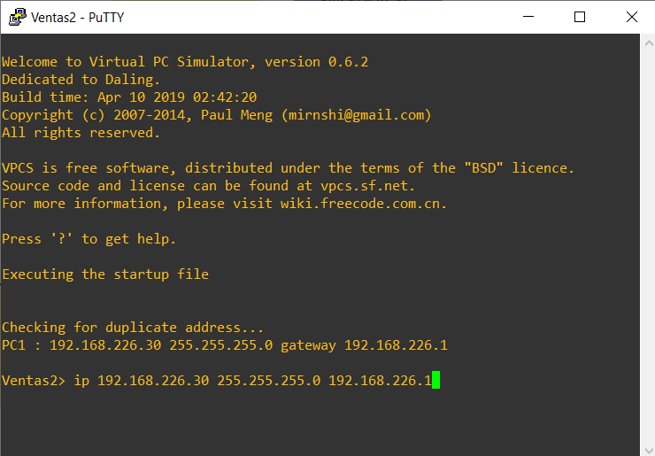
    <p align="center">Configuracion VPCS Ventas</p>
</div>
<br/>

<div align="center">
    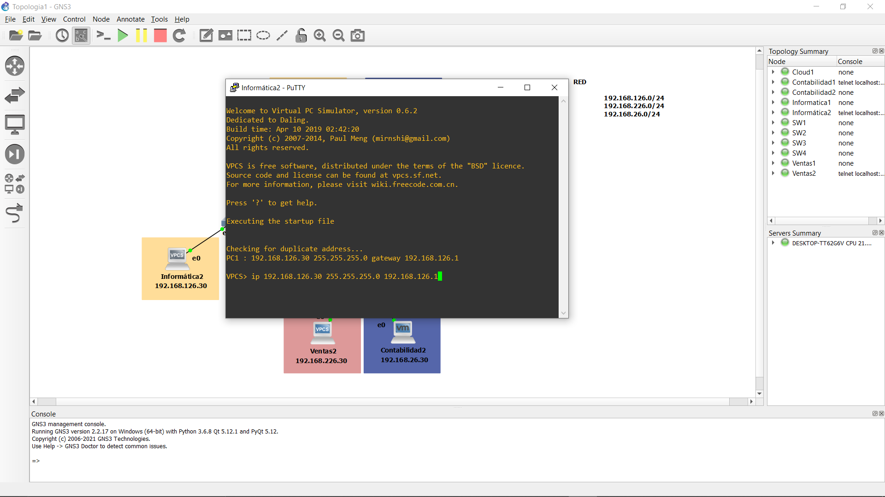
    <p align="center">Configuracion VPCS Informática</p>
</div>

### **Computadoras virtualizadas**
#### GNS3
Para la utilización de las maquinas virtualizadas en vmware es necesario habilitar las interfaces de red necesarias.

- Para esto ingresamos al menú *edit* y luego en la opcion *preferences*

<div align="center">
    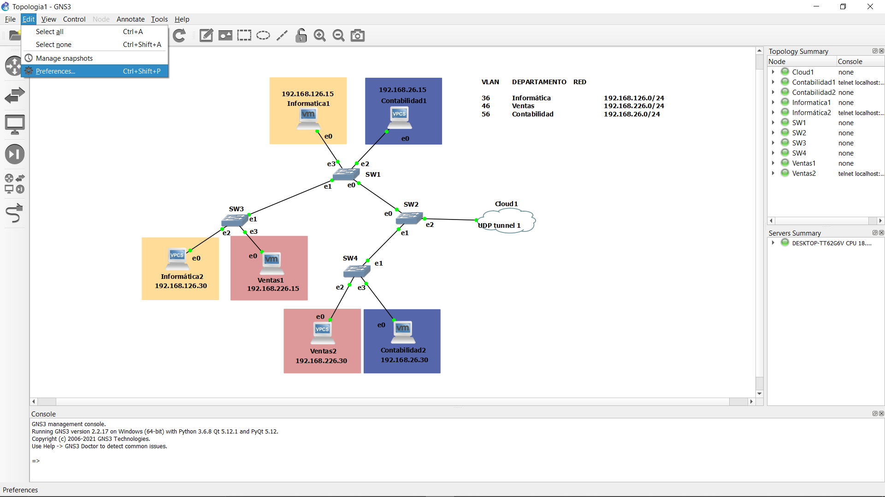
    <p align="center">Opcion preferences</p>
</div>

- En la ventana desplegada buscamos el submeu *VMware* y luego en la pestaña *Advance local settings*, cambiamos la cantidad de interfaces a generar y le damos *Configure*

<div align="center">
    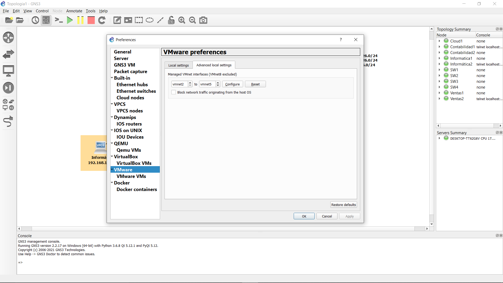
    <p align="center">Opcion preferences</p>
</div>

Luego de haber habilitado las interfaces, es necesario abrir revisar que se hayan creado correctamente.

* Abrimos el programa *ejectuar* y escribimos el siguiente comando para abrir las conexiones de red
```bash
ncpa.cpl
```

<div align="center">
    
    <p align="center">Ventana ejecutar</p>
</div>
<br/>

<div align="center">
    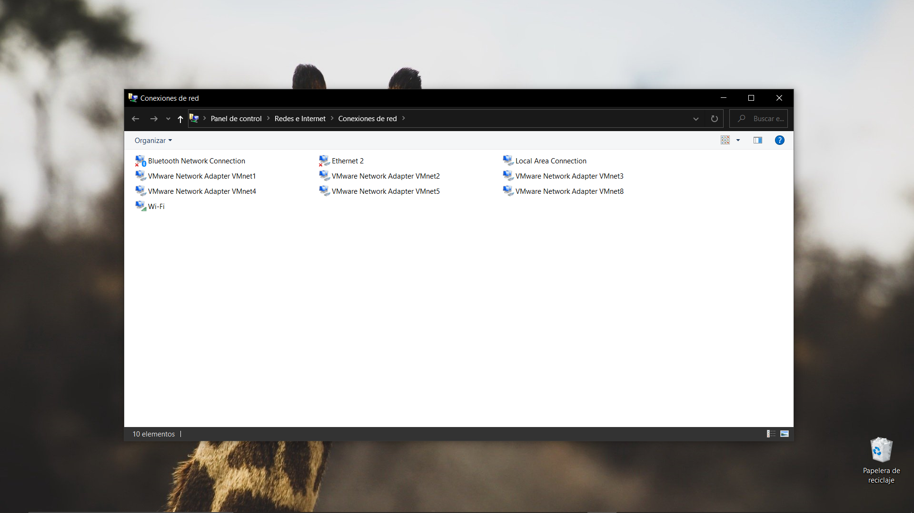
    <p align="center">Conexiones de red</p>
</div>

Se deben importar las maquinas virtuales para ser utilizadas.

* Debemos ingresar al menú *VMware VMs* y en luego en *New*

<div align="center">
    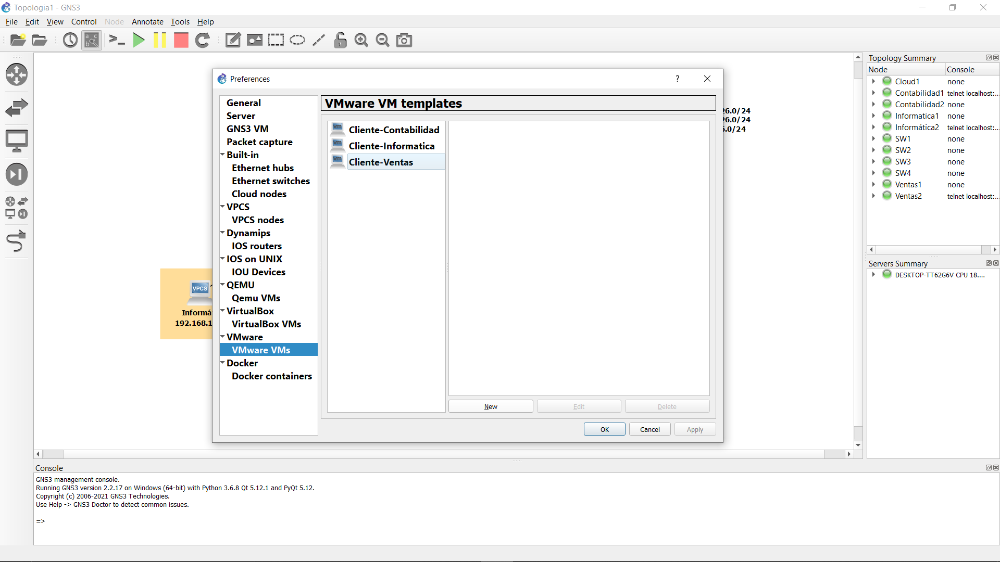
    <p align="center">Maquinas virtuales</p>
</div>

#### VMware
Es necesario configurarle a cada virtual su correspondiente dirección ip, mascara de red y gateway.

<div align="center">
    
    <p align="center">Paso 1 configuración IP manual Linux Zorin</p>
</div>
<br/>

<div align="center">
    
    <p align="center">Paso 2 configuración IP manual Linux Zorin</p>
</div>
<br/>

<div align="center">
    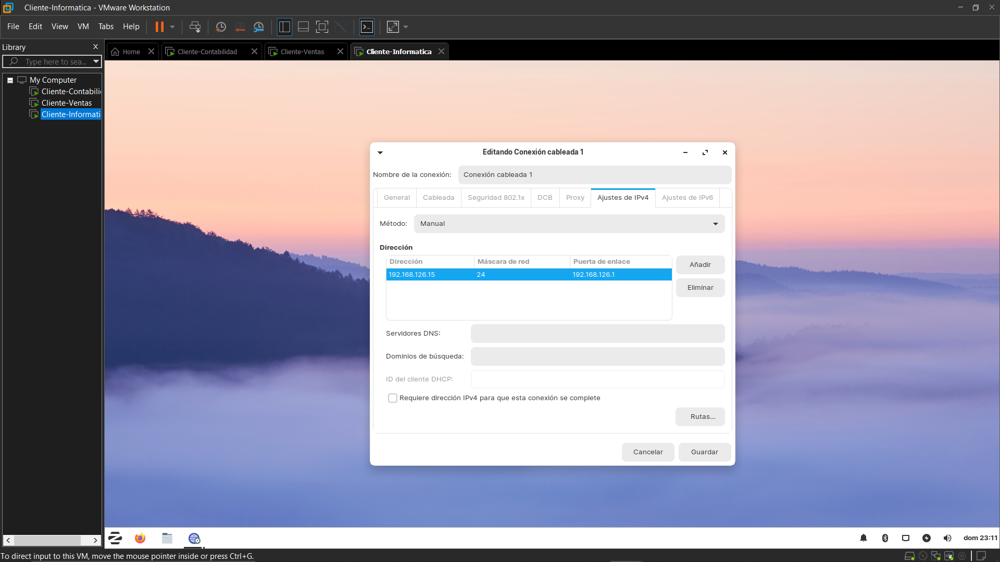
    <p align="center">Paso 3 configuración IP manual Linux Zorin</p>
</div>
<br/>

Luego de haber configurado las ip es necesario cambiar la configuración de las tarjetas de red en cada maquina virtual, por las generadas en GNS3.

<div align="center">
    
    <p align="center">Configuración tarjeta de red</p>
</div>
<br/>

## **Topología 2**<a name="idTopo2"></a>

## **Configuración VPN**<a name="idVPN"></a>